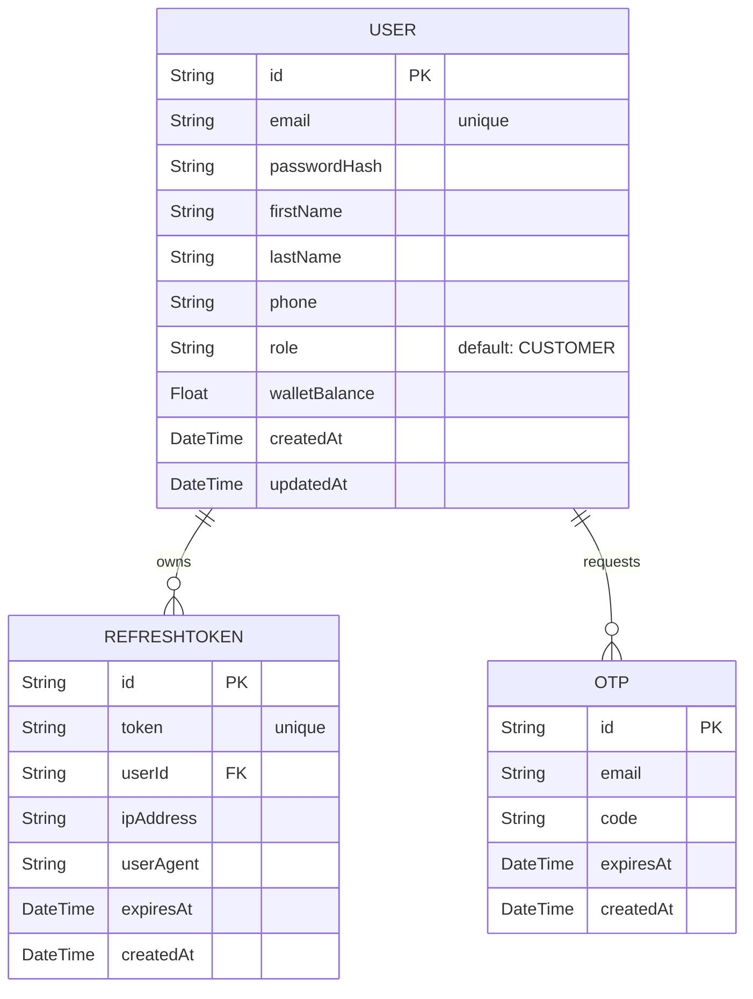

# Database Authentication Schema & Integrity

This document outlines the authentication structures in the SQLite database managed via Prisma.

---

## Data Models

---

## Key Constraints & Indexes

1. **Unique Email Constraint**: The `User` model email is unique (`@unique`). Emails are normalized to lowercase on registration and login.
2. **Unique Token Constraint**: The `RefreshToken` token is unique (`@unique`) to prevent token reuse and session hijacking.
3. **Cascase On Delete**: When a `User` is deleted, all owned `RefreshToken` records cascade delete.
4. **OTP PIN Cleanup**: Password reset PINs (`Otp`) expire in 10 minutes and are completely wiped after verification.
